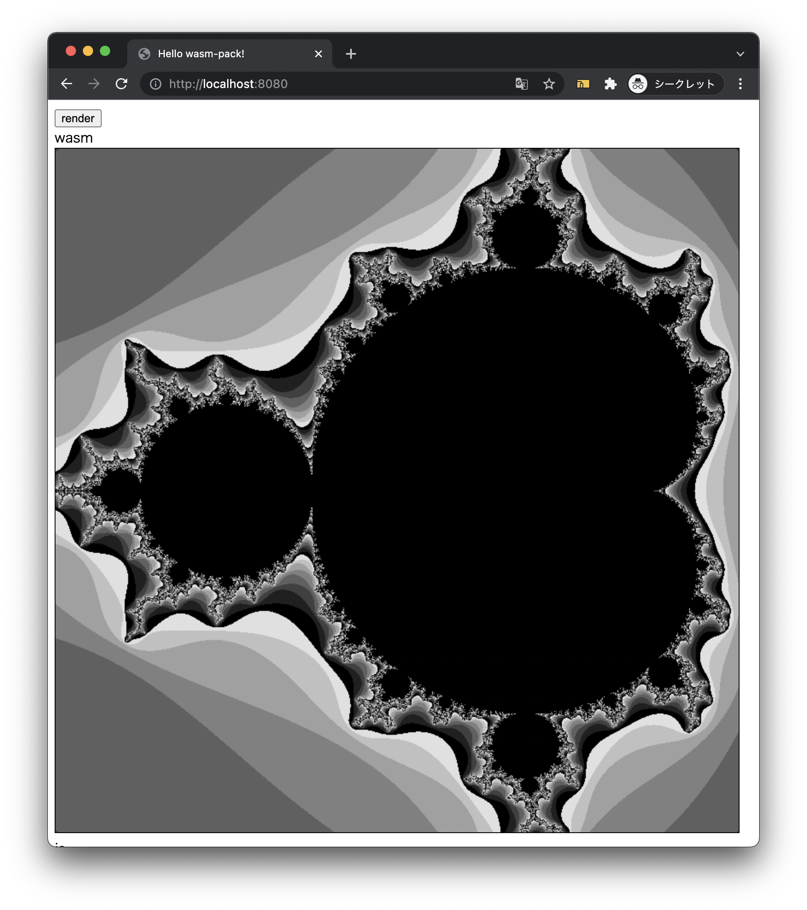

# rust-wasm-mandelbrot

WebAssembly でマンデルブロ集合を描きます

## 事前準備

### 1. wasm-pack のインストール

この URL からインストールしてください。

https://rustwasm.github.io/wasm-pack/installer/

### 2. node(npm)のインストール

この URL からインストールしてください。動作は`v16.13.0`で確認しています。

https://nodejs.org/ja/

### 3. wasm バイナリのビルド

ルートディレクトリで下記を実行してください。`pkg/` フォルダが生成されます。

```console
$ wasm-pack build
```

### 4. node_modules のインストール

ルートディレクトリで下記を実行してください。

```console
$ cd www
$ npm install
```

## 開発用サーバー起動

ルートディレクトリで下記を実行してください。

```console
$ cd www
$ npm start
```

http://localhost:8080 にアクセスし、「render」ボタンをクリックしてください。下記のようにマンデルブロ集合が描画されます。


